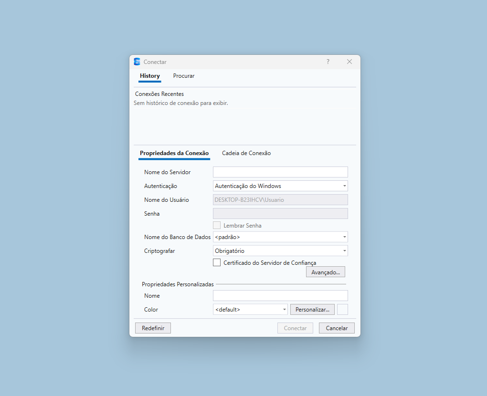
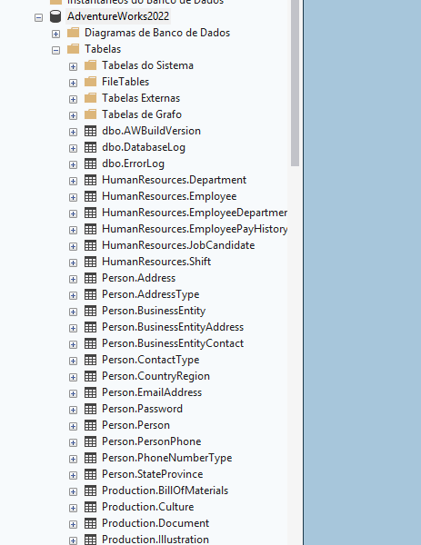
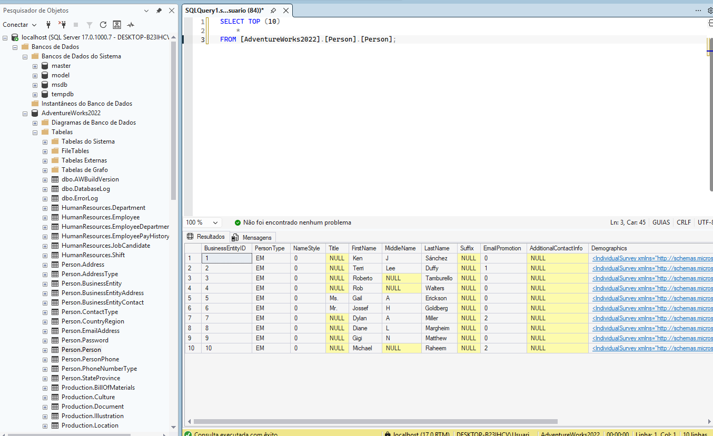

[← Voltar para a Jornada](/blog/jornada-sql)

<!--truncate-->

Resolvi baixar o **SQL Server** como meu SGBD porque é o que me sinto mais familiarizado e acho que cumpre bem o que promete.

Sinceramente, achei o processo de instalação meio estranho. Como nunca tinha feito isso do zero, não tinha certeza absoluta do que estava fazendo. Fui seguindo alguns tutoriais e tentando na mão. Minha meta para o primeiro dia era simples:
* Ter o SQL Server instalado.
* Garantir a interface visual (SSMS).
* Deixar um *dataset* pronto para uso.

---

## A Instalação e os Primeiros Perrengues

Fiz o download do SQL Server no [site oficial da Microsoft](https://www.microsoft.com/pt-br/sql-server/sql-server-downloads). Ele roda em segundo plano na máquina para processar a base de dados. Já a interface visual (SSMS - SQL Server Management Studio) é disponibilizada para download logo após o término da instalação principal.

> **Primeiro estresse:** Achei um saco ter que instalar o *Visual Studio Installer* só para poder utilizar o SQL Server. Mais uma coisa para ficar ocupando espaço e bagunçando meu PC...

---

## Primeiro Contratempo: Erro de Conexão

Assim que abri a tela para me conectar ao servidor, dei de cara com esta tela:



*Como que eu vou saber de primeira o que preciso fazer aqui?*

Para não perder muito tempo travado, pesquisei rápido e descobri o macete:
* No campo do servidor, basta colocar `localhost` ou simplesmente um ponto (`.`).
* Marcar a caixa **"Certificado de Servidor de Confiança"** (Trust Server Certificate).

Isso avisa ao programa que ele pode confiar na conexão local do meu próprio computador, liberando o acesso imediato. Com certeza é interessante aprender mais sobre segurança e controle de acessos depois, mas agora meu foco total é **escrever queries**.

---

## Carregando o Data Set: AdventureWorks

Com a conexão resolvida, finalmente cheguei na interface. Confesso que fiquei surpreso: o SQL Server atual está com um visual bem mais moderno do que a versão que uso no trabalho.

Para fechar o dia com chave de ouro, baixei meu primeiro *dataset* real: o **AdventureWorks2022**, um banco de dados clássico da Microsoft, excelente para treinar relacionamentos de tabelas, vendas e dados de funcionários.

1. Baixei o arquivo de backup (`AdventureWorks2022.bak`) no [site oficial da Microsoft](https://learn.microsoft.com/en-us/sql/samples/adventureworks-install-configure?view=sql-server-ver17&tabs=ssms).
2. Salvei o arquivo na minha pasta de estudos de SQL.

### Como restaurar o banco no SGBD:
* Cliquei com o botão direito em **Bancos de Dados (Databases)** > **Restaurar Banco de Dados...**
* Na tela que abriu, alterei a origem para **Dispositivo (Device)**.
* Selecionei o caminho do arquivo `.bak` no PC e mandei restaurar.

Com isso, o dataset foi carregado e as tabelas finalmente apareceram:



---

## O Primeiro SELECT

Para testar se estava tudo rodando 100%, fechei o dia executando minha primeira consulta básica:

```sql
SELECT TOP 10 * FROM Person.Person;
```



---

**[Dia 2: Explorando o Data Set AdventureWorks2022 →](/blog/jornada-sql/dia-02)**
